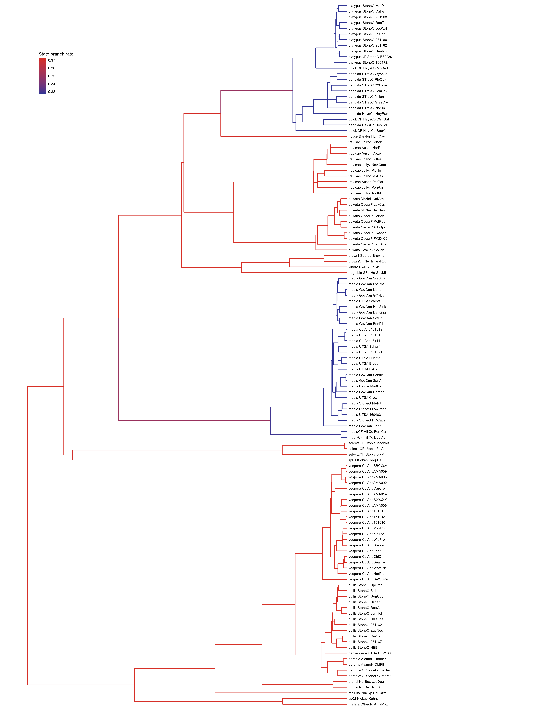
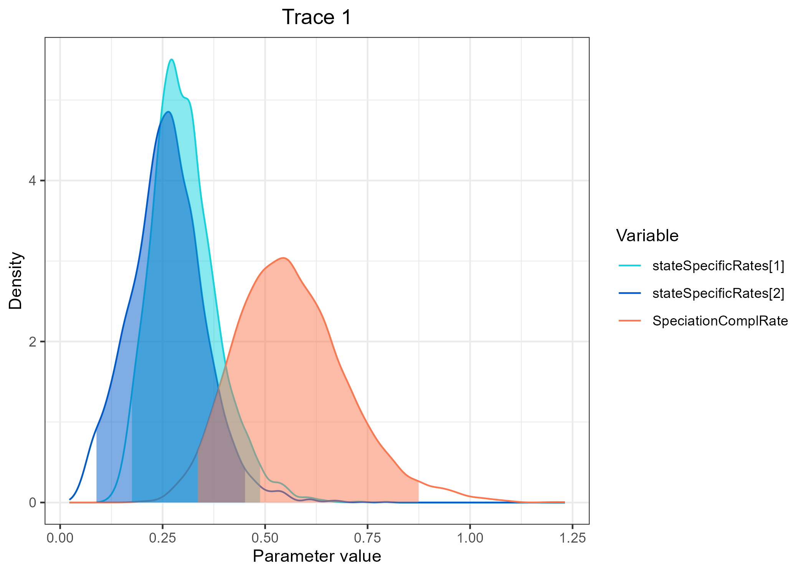

# <ins>Tra</ins>it <ins>De</ins>pendent <ins>R</ins>ates <ins>Pro</ins>tracted <ins>S</ins>peciation (TraDeRProS)

## Introduction

## TraDeRProS in RevBayes

### Getting started  

Clone this directory, start RevBayes from your [scripts](./scripts) directory. 

```R
git clone LINK

cd TraderProS/scripts

rb 
```

Set seed if you want to replicate the analysis.
```R
seed(1)
```  

Set the path to inputs and outputs  

```R
workDirPath = "../"
dataDirPath = workDirPath + "data/"
outDirPath = workDirPath + "outputs/"
outputPrefix = "traderpros"
popMapPath = dataDirPath + "popmap.tsv"
treePath = dataDirPath + "BPPConstraint.MCC.CAH.nex"
traitPath = dataDirPath + "CicTroglomorphism.nex"
```

Create helpers variables vor the moves and monitors.
```R
moves = VectorMoves()
monitors = VectorMonitors()
```  

### The Data
We first read the tree, the population to species map, the trait data and get some variables to use later. The population to species map is a tab delimited file, with headers, which the first column is the population (the name of the tips in the tree file) and the second column is the species from which the population belongs to. If the species assignment is uncertain, the species name should be "unknown". The algorithm will ignore those for estimating the trait specific rates. Note that the uncertainty on species partition is not averaged her, but could be possible if you sample from all possible (or a few) different species partition.

```R
# Read the tree file
tree <- readTrees(treePath)[1]

# Save tree with branch indexes
writeNexus(tree, filename=outDirPath+outputPrefix+"_indexed.tree.nex")

# Get the number of nodes and branches
n_nodes <- tree.nnodes()
n_branches <- n_nodes -1

# Read population to species map
popMap = readDataDelimitedFile(popMapPath, header=TRUE)

# Read trait data
trait <- readDiscreteCharacterData(traitPath)

# Get number of states
n_states <- trait.getStateDescriptions().size()
```
  
### The transition matrix
We first define the prior on the global trait transition rate. Although it is possible to independently infer the transition rates here with a less informative distribution, we will use a distribution based on the results of a previous analyses using HiSSE [here](). It has been shown before that transition rates might be wrongly inferred if it is influencing the tree shape in a state dependent birth and death model (REF). Ideally, we would use a birth and death tree process jointly with our protracted speciation to estimate rates in a trait dependent protracted speciation birth and death. However that could be time consuming, so we first jointly inferred the transition, extinction (death) and population formation (birth) in a HiSSE model, and use the posterior distribution to inform our transition rate here. The protracted speciation part of the model will be determined later here.

```R
global_trans_rate <- 0.0269
relative_transition <- simplex(1,0)
```

>Use the code below instead if you want to estimate the transition rate using a exponential distribution
>>```
>>>traRate_expoDistrib_parameter <- 10
>>>global_trans_rate ~  dnExp(traRate_expoDistrib_parameter)
>>>moves.append( mvScale( global_trans_rate, weight=1 ) )
>>```
>  
>Also, if you are estimating the rates you should draw the relative transition rates from a distribution, such as a flat Dirichlet distribution. We also can create a reversible jump to test if troglomorphism is reversible
>>```R
>>n_rates = n_states * (n_states-1)
>>relative_transition ~ dnReversibleJumpMixture( simplex(1,0), dnDirichlet(rep(1, n_states)), p=0.5 )
>>
>>moves.append( mvRJSwitch(relative_transition , weight=1.0) )
>>moves.append( mvDirichletSimplex( relative_transition, weight=1 ) )
>>
>>is_troglo_reversible := ifelse( relative_transition == simplex(1,0), 0.0, 1.0)
>>```


We can now create our transition rate matrix.
```R
Q := fnFreeK(relative_transition, rescale=TRUE)
```

We also  create a prior for the root state frequency. We assume equal probabilities.
```R
rf <- simplex(rep(1,n_states))
```

We will use data augmentation to sample the trait history evolution along the tree, similar to what is done [here](https://revbayes.github.io/tutorials/cont_traits/state_dependent_bm.html).  

Now we can create our augmented data matrix DAG node of our model that sample the trait evolution history. We clamp the node to our observed trait matrix.
```R
trait_evol ~ dnPhyloCTMCDASiteIID(tree,
                                  Q,
                                  branchRates=global_trans_rate,
                                  type="Standard",
                                  nSites=1,
                                  rootFrequencies=rf)

trait_evol.clamp(trait)
```

We need to create moves for the character history along the branches.
```R
moves.append( mvCharacterHistory(ctmc=trait_evol, 
                                 qmap_site=Q,
                                 graph="node",
                                 proposal="rejection",
                                 weight=round(n_nodes/2)) )
moves.append( mvCharacterHistory(ctmc=trait_evol,
                                 qmap_site=Q,
                                 graph="branch",
                                 proposal="rejection",
                                 weight=round(n_branches/2)) )
```

### Speciation Completion Rates
We sample a global rate from an exponential distribution.
The expected global rate may be given by 'ln(n_species-1)/trootAge()'. That is, if you have a total of 20 species (sampled and unsampled.) in a group that is 5 my old,  you expect at least 19 speciation events in the total time. Therefore the expected speciation completion rate would be around 0.5888878. 
This is because the number of speciation events in the whole tree is Poisson distributed 'nSpeciationEvents ~ Poisson(exp(expected_speciation_completion_rate*rootAge))'
We can create a prior distribution centered on the expected rate. Since the value must be positive, we use a Lognormal distribution. We treat the expected rate as the mode of the distribution. We used a standard deviation of 1. If you want a more informative prior you can reduce the standard deviation or even use a fixed global rate


```R
totalSpecies <- 76
lognormal_sd <- 1
expected_rate := ln(abs(totalSpecies-1))/tree.rootAge()
sd_real <- exp(lognormal_sd)
mean := ln(abs(expected_rate)) + ln(sd_real)^2
SpeciationComplRate ~ dnLognormal(abs(mean), lognormal_sd)
SpeciationComplRate.setValue(expected_rate)

# if you want to treat the expected rate as mean, use the code below instead.
#SpeciationComplRate ~ dnLognormal(ln(abs(expected_rate)), lognormal_sd)
#SpeciationComplRate.setValue(expected_rate)
```  
We need to create moves to the speciation completion rates.
```R
moves.append(mvScale(SpeciationComplRate, weight=1))
```

The global rate is the sum of each state specific rate. To determine the vector of state specific rates, we first draw proportional weights from a Dirichlet distribution with flat prior. Then, we multiply each rate by the global rate to have each state specific rates. We use a reversible jump to test for state dependent rates.

```R
stateSpecificRateWeights ~ dnReversibleJumpMixture( simplex(rep(1, n_states)), dnDirichlet(rep(1, n_states)), p=0.5 )

moves.append( mvRJSwitch(stateSpecificRateWeights, weight=1.0) )
moves.append(mvSimplex(stateSpecificRateWeights, weight=1))

is_spCompletion_state_dependent := ifelse( stateSpecificRateWeights == simplex(rep(1, n_states)), 0.0, 1.0)

# If you do not want to use a reversible jum, just use the commented code below, instead.
#stateSpecificRateWeights ~ dnDirichlet(rep(1, n_states))
#moves.append(mvSimplex(stateSpecificRateWeights, weight=1))

stateSpecificRates := stateSpecificRateWeights * SpeciationComplRate
```

The branch specific rates are determined by the relative time spent on each trait in that branch. The method `trait_evol.relativeTimeInStates(i,1)` calculates the proprtion of time the charcater 1 spent on each state in the branch *i*.
```R
for(i in 1:n_branches) {
    state_branch_rate[i] := sum(trait_evol.relativeTimeInStates(i,1) * stateSpecificRates)
}
```

## The Trait Dependent Rates Protracted Speciation Tree
We first use our population map to replace the tip names for species names.
```R
TreeSpeciesTip <- tree
for (i in 1:popMap.size()){
    TreeSpeciesTip.setTaxonName(popMap[i][1], popMap[i][2] )
    }
write(TreeSpeciesTip, filename=outDirPath+outputPrefix+".SpeciesName.tree" )
```

Our model is similar to the one used in [DELINEATE](https://jeetsukumaran.github.io/delineate/) ([Sukumaran et al. 2021][1]) in the way that assumes that the number of speciation events in each branch is Poisson distributed. The difference is that the rates in each branch will vary according to the state in that branch instead of a single global rate. That is, ```N_speciation_events_branch[i] ~ Poisson(exp(state_branch_rate[i]*branch_length[i]))``` where *i* is the branch in the tree, and *state_branch_rate[i]* is the rate accountinfor the time spent in each state in the branch *i* (created in the step above). We know that speciation completion did not happened on branches that connect populations, so we can constrain the number of speciation events to 0. If the branches connects populations of two different species, at least one speciation events must have happened in at least one of the sister branches. Branches that connect populations with unknown status or that connects more than two species are not used, since we cannot constrain the number of speciation events in each branch [FIGURES]().  The number of speciation events on those branches can be co-estimated with the rates.  
With a set of rules we can visit branches in the tree and set the constraints, and calculate the likelihood of observing the constrained speciation (and no speciation) events in the tree given the ancestral states in each branch, a vector of state specific speciation completion rates and a vector of branch lengths: P(SpeciationEventsConstraints | ancestralStates, stateSpecificRates, BranchLengths). Since we are using a bayesian approach, we can sample from a prior distributions of states, rates and branch lengths to approximate the posterior distribution of the observed speciation and no speciation events: P( ancestralStates, stateSpecificRates, BranchLengths| SpeciationEventsConstraints). Here we will assume the branch lengths as fixed, so we are approximating P( ancestralStates, stateSpecificRates | SpeciationEventsConstraints, BranchLengths).  We can also co-estimate the number of speciation events on the unconstrained branches P( ancestralStates, stateSpecificRates, BranchSpeciationEvents | SpeciationEventsConstraints, BranchLengths).  

> Note: Although paraphyletic species could be used with this approach, our implementation here does not account for paraphyletic species. It can wrongly estimate parameters if paraphyletic species are used. So, do not input paraphyletic species constraints. Paraphyletic species can be inferred, though. 

First we create an stochastic variable to hold the number of speciation events on each branch
```R
for (i in 1:(n_branches)){
    branch_speciation_events[i] ~ dnPoisson(exp(state_branch_rate[i]*TreeSpeciesTip.branchLength(i)))
}
```

We now iterate over the tree nodes to clamp the number of speciation events to zero if the node has child branches with descendants belonging to the same species and create moves o the number of speciation events on the other branches.

```R
iteration=1
for (i in (tree.ntips()+1):n_nodes){
    j=iteration++
    # Visit every internal node i of the tree and get child branches indices and branch lengths
    c1[j] = TreeSpeciesTip.child(i,1)
    c2[j]  = TreeSpeciesTip.child(i,2)

    # Get the descendants of each child to know if they connect same or different species
    c1descendants[j] = TreeSpeciesTip.getDescendantTaxa(c1[j])
    c2descendants[j] = TreeSpeciesTip.getDescendantTaxa(c2[j])

    # Get a list of descendant species to know if node connects population of same or different species
    c1splist[j] = [c1descendants[j][1].getName()]
    if (c1descendants[j].size() > 1){
        for (n in 2:c1descendants[j].size()){
        c1splist[j].append([c1descendants[j][n].getName()])
        }
    }
    c1splist[j].unique()

    c2splist[j] = [c2descendants[j][1].getName()]
    if (c2descendants[j].size() > 1){
        for (n in 2:c2descendants[j].size()){
        c2splist[j].append([c2descendants[j][n].getName()])
        }
    }
    c2splist[j].unique()

    # If node connects populations of same species, clamp the observed value to 0 to indicate that no speciation can be observed. It is only applicable if the species has known assignments. If node connects population of different species we assign moves to it so it can be sampled during MCMC.
    if ((c1splist[j].size() == 1 & c2splist[j].size() == 1 & c1splist[j].contains("unknown")==FALSE & c2splist[j].contains("unknown")==FALSE) & ( c1splist[j][1] == c2splist[j][1])) {
        branch_speciation_events[c1[j]].clamp(0)
        branch_speciation_events[c2[j]].clamp(0)
    } else {
        moves.append(mvRandomNaturalWalk(branch_speciation_events[c1[j]], weight=1))
        moves.append(mvRandomNaturalWalk(branch_speciation_events[c2[j]], weight=1))
    }
}
```

We add a reversible jump to track the probability of having speciation events on branches of interest. You can check the branch index in the [tree with species names](outputs/traderpros.SpeciesName.tree)
```R
branch_speciation_events[115] ~ dnReversibleJumpMixture( 0, dnPoisson(exp(state_branch_rate[115]*TreeSpeciesTip.branchLength(115))), p=0.5 )
moves.append( mvRJSwitch(branch_speciation_events[115], weight=1.0) )
speciation_br115 := ifelse(branch_speciation_events[115] == 0, 0, 1)

branch_speciation_events[116] ~ dnReversibleJumpMixture( 0, dnPoisson(exp(state_branch_rate[116]*TreeSpeciesTip.branchLength(116))), p=0.5 )
moves.append( mvRJSwitch(branch_speciation_events[116], weight=1.0) )
speciation_br116 := ifelse(branch_speciation_events[116] == 0, 0, 1)

branch_speciation_events[117] ~ dnReversibleJumpMixture( 0, dnPoisson(exp(state_branch_rate[117]*TreeSpeciesTip.branchLength(117))), p=0.5 )
moves.append( mvRJSwitch(branch_speciation_events[117], weight=1.0) )
speciation_br117 := ifelse(branch_speciation_events[117] == 0, 0, 1)

branch_speciation_events[118] ~ dnReversibleJumpMixture( 0, dnPoisson(exp(state_branch_rate[118]*TreeSpeciesTip.branchLength(118))), p=0.5 )
moves.append( mvRJSwitch(branch_speciation_events[118], weight=1.0) )
speciation_br118 := ifelse(branch_speciation_events[118] == 0, 0, 1)

branch_speciation_events[119] ~ dnReversibleJumpMixture( 0, dnPoisson(exp(state_branch_rate[119]*TreeSpeciesTip.branchLength(119))), p=0.5 )
moves.append( mvRJSwitch(branch_speciation_events[119], weight=1.0) )
speciation_br119 := ifelse(branch_speciation_events[119] == 0, 0, 1)

branch_speciation_events[127] ~ dnReversibleJumpMixture( 0, dnPoisson(exp(state_branch_rate[127]*TreeSpeciesTip.branchLength(127))), p=0.5 )
moves.append( mvRJSwitch(branch_speciation_events[127], weight=1.0) )
speciation_br127 := ifelse(branch_speciation_events[127] == 0, 0, 1)

branch_speciation_events[128] ~ dnReversibleJumpMixture( 0, dnPoisson(exp(state_branch_rate[128]*TreeSpeciesTip.branchLength(128))), p=0.5 )
moves.append( mvRJSwitch(branch_speciation_events[128], weight=1.0) )
speciation_br128 := ifelse(branch_speciation_events[128] == 0, 0, 1)

branch_speciation_events[129] ~ dnReversibleJumpMixture( 0, dnPoisson(exp(state_branch_rate[129]*TreeSpeciesTip.branchLength(129))), p=0.5 )
moves.append( mvRJSwitch(branch_speciation_events[129], weight=1.0) )
speciation_br129 := ifelse(branch_speciation_events[129] == 0, 0, 1)

branch_speciation_events[140] ~ dnReversibleJumpMixture( 0, dnPoisson(exp(state_branch_rate[140]*TreeSpeciesTip.branchLength(140))), p=0.5 )
moves.append( mvRJSwitch(branch_speciation_events[140], weight=1.0) )
speciation_br140 := ifelse(branch_speciation_events[140] == 0, 0, 1)

branch_speciation_events[141] ~ dnReversibleJumpMixture( 0, dnPoisson(exp(state_branch_rate[141]*TreeSpeciesTip.branchLength(141))), p=0.5 )
moves.append( mvRJSwitch(branch_speciation_events[141], weight=1.0) )
speciation_br141 := ifelse(branch_speciation_events[141] == 0, 0, 1)

branch_speciation_events[142] ~ dnReversibleJumpMixture( 0, dnPoisson(exp(state_branch_rate[142]*TreeSpeciesTip.branchLength(142))), p=0.5 )
moves.append( mvRJSwitch(branch_speciation_events[142], weight=1.0) )
speciation_br142 := ifelse(branch_speciation_events[142] == 0, 0, 1)
```

Now we create the likelihood of observing constrained speciation events. As we mentioned before, at least one speciation event must have occurred in the tree path connecting two species.
  
We create a new tree to modify the branch lengths according to the number of speciation events
```R
# This tree is the one with species name as tips, which would be used for the topology
topology <- readBranchLengthTrees(outDirPath+outputPrefix+".SpeciesName.tree")[1]
# We use the number of speciation events to assign branch lengths to the topology
SpeciationBranchTree := fnTreeAssembly(topology, branch_speciation_events)

# The tree below is the same as above, but with population names. This is the one we are interested to see, althou the one above is used for the actual algorithm. 
topologyPopNames <- readBranchLengthTrees(treePath)[1]
SpeciationBranchTreePoNames := fnTreeAssembly(topologyPopNames, branch_speciation_events)
```
Now we can create a likelihood function to constrain the search to speciation history congruent with the observed species limits. We create a pairwise distance matrix between all tips in the tree with branch lengths representing sampled speciation events. If the distance between two tips with different species assignments is zero, it means that the likelihood of observing that speciation history is zero. Therefore, the number of speciation events must be between 1 and the maximum number of events allowed. We set the maximum allowed to be the number of species in the group minus 1. You can reduce that, since we only sample ~24 species and that many speciation events between to tips might be unlikely.

```R
distanceMatrix := fnTreePairwiseDistances(SpeciationBranchTree)

index=1
maxSpeciationConnectingTwoTips = totalSpecies-1
for (i in 1:distanceMatrix.size()){
    for (j in 1:distanceMatrix.size()){
      if ((distanceMatrix.names()[i] != distanceMatrix.names()[j]) & (distanceMatrix.names()[i]!= "unknown" & distanceMatrix.names()[j]!= "unknown")){
        m=index++
        constraintViolation[m] ~ dnUniformInteger(int(distanceMatrix.matrix()[i][j]- maxSpeciationConnectingTwoTips),
                                                    int(distanceMatrix.matrix()[i][j]- 1))
        constraintViolation[m].clamp(0) 
      }
    }
}
```

We can also stablish a constrain for the minimum number of speciation events in the whole tree. This should be at least the minimum number of known species minus 1. The maximum number can be an estimative of how many species there are in the group. There are 76 known species of *Cicurina* (*Cicurela*) (Hedin 2015, 2018; Paquin and Duperree 2009; WSC 2024) if we consider 75% of the species are known, then the upper interval could be 100 species. We will allow the number of species to be a little smaller than the know number of species(76), so we con account for possible synonyms in the list of know species names. The minimum number will be determined by the e Using the same approach as done above, we can create the a priori probability of he number of speciation events being zero if smaller than the minimum number of species.

```R
min_n_species = 70
max_n_species = 100
n_speciation_events := sum(branch_speciation_events)
deviation_of_expected_events ~ dnUniformInteger(n_speciation_events - (max_n_species-1),
                                   n_speciation_events - (min_n_species-1)
                                   )
deviation_of_expected_events.clamp(0)
```

We can now finalize our model 
```R
mymodel = model(branch_speciation_events)
```

### The MCMC
Define the number of generations, burn in and print frequency
```R
## Number of generations
n_gen = 1000000
## Print to screen every x generations
n_print_screen = 1000
## Print parameters to file every x generations
n_print_log = 1000
## Print tree to file every x generations
n_print_tree=1000
## Number of independent runs
n_runs = 1
## Create checkpoint file every x generations
n_check_interval = 1000
## Burn in
burnin_percentage = 0.10 
```

Monitor variables of interest
```R
# print to screen
monitors.append( mnScreen(printgen=n_print_screen) )

# Monitor all parameters
monitors.append( mnModel(file=outDirPath+outputPrefix+".model.log", 
                          printgen=n_print_log) )

# monitor rates
monitors.append( mnFile(SpeciationComplRate, stateSpecificRates,
                        filename=outDirPath+outputPrefix+".Rates.log",
                        printgen=n_print_log) )

# monitor reversible jumps hypotheses
monitors.append( mnFile(is_troglo_reversible, 
                        is_spCompletion_state_dependent,
                        filename=outDirPath+outputPrefix+".RJ.log",
                        printgen=n_print_log) )

# Monitor tree with speciation events
monitors.append( mnFile(SpeciationBranchTreePoNames, 
                        filename=outDirPath+outputPrefix+".EventsTree.log", 
                        printgen=n_print_tree) )

# Monitor trait evolution
monitors.append( mnFile( tree, filename=outDirPath+outputPrefix+".tre", 
                        printgen=n_print_tree) )

monitors.append( mnCharacterHistorySummary( filename=outDirPath+outputPrefix+".history.txt",
                                            ctmc=trait_evol,
                                            tree=tree,
                                            printgen=n_print_tree ) )

monitors.append(mnCharHistoryNewick(ctmc=trait_evol,
                                    tree=tree,
                                    filename=outDirPath+outputPrefix+".history.nwck", 
                                    printgen=n_print_tree ) )


# Monitor tree with speciation completion branch rates
monitors.append( mnExtNewick(
                 filename=outDirPath+outputPrefix+".SpCompletionRates.trees",
                 isNodeParameter=TRUE,
                 printgen=n_print_tree,
                 separator=TAB,
                 tree=tree,
                 state_branch_rate
                 ))

# Monitor tree with branch speciation events
monitors.append( mnExtNewick(
                 filename=outDirPath+outputPrefix+".SpeciationEvents.trees",
                 isNodeParameter=TRUE,
                 printgen=n_print_tree,
                 separator=TAB,
                 tree=tree, 
                 branch_speciation_events
                 ) )

# monitor speciation events
monitors.append( mnFile(branch_speciation_events,
                        filename=outDirPath+outputPrefix+".SpeciationEvents.log",
                        printgen=n_print_log) )
```


Now we can create the MCMC object and run

```R
mymcmc = mcmc(mymodel, monitors, moves, nruns=n_runs, combine="mixed")

mymcmc.burnin(generations = burnin_percentage*n_gen, tuningInterval = burnin_percentage*n_gen*0.1)

mymcmc.run(n_gen, checkpointFile=outDirPath+outputPrefix+".checkpoint", 
           checkpointInterval= n_check_interval )
```

## Process results
We can now summarize the results

```R
# Summarize tree with branch lengths in number of speciation events 
treeTrace = readTreeTrace(outDirPath+outputPrefix+".EventsTree.log",
            burnin=burnin_percentage )
mapTree(treeTrace,
        file=outDirPath+outputPrefix+".EventsTree.MAP.tre",
        ccAges=TRUE,
        ccp=TRUE,
        conditionalAges=TRUE,
        mean=FALSE,
        sampledAncestors=FALSE,
        positiveBranchLengths=FALSE)

# Summarize tree with info on number of speciation events
treeTrace2 = readTreeTrace(outDirPath+outputPrefix+".SpeciationEvents.trees",
            burnin=burnin_percentage )
mapTree(treeTrace2,
        file=outDirPath+outputPrefix+".SpeciationEvents.MAP.tre",
        mean=FALSE
        )
# The output needs some modification. We use a bash command to do it.
system("sed -i 's/=1}/}/g' ../outputs/*.SpeciationEvents.MAP.tre")


# Summarize tree with speciation completion rates
treeTrace3 = readTreeTrace(outDirPath+outputPrefix+".SpCompletionRates.trees",
            burnin=burnin_percentage )
mapTree(treeTrace3,
        file=outDirPath+outputPrefix+".SpCompletionRates.MAP.tre")
```

## Plot results with RevGadgets

Open R


```R
library(ggplot2)
library(RevGadgets)
library(coda)
library(RColorBrewer)
library(viridis)

# output and input directories
outFigsDir = "../outfigs/"
inputFilesDir = "../outputs/"

ifelse(!dir.exists(file.path(outFigsDir)), dir.create(file.path(outFigsDir)), "Output directory exists.Rename it or make sure files within will have diferent names")


# files
treeFile = paste(inputFilesDir,"traderpros.SpCompletionRates.MAP.tre", sep = "")
eventsTreeFile = paste(inputFilesDir, "traderpros.SpeciationEvents.MAP.tre", sep = "")
traceFile = paste(inputFilesDir,  "traderpros.model.log", sep = "")
ratesTraceFile = paste(inputFilesDir,  "traderpros.Rates.log", sep = "")


# burnin percentege
burn = 0.10

# Plot tree with rates
tree = readTrees(treeFile)

pal_name <- "RdYlBu"
ratecolors <- brewer.pal(n = 11, name = pal_name)

SpCompletionRate <- plotTree(tree = tree, 
                   node_age_bars = FALSE,
                   node_pp = FALSE, 
                   tip_labels = TRUE,
                   tip_labels_size = 3,
                   color_branch_by = "state_branch_rate",
                   branch_color=c(ratecolors[11], ratecolors[2]),
                   line_width = 0.8) + 
  ggplot2::theme(legend.position=c(.1, .9));SpCompletionRate

ggsave(SpCompletionRate,file=paste(outFigsDir, "traderpros.SpCompRates.tree.pdf", sep=""), width = 18, height = 24)
ggsave(SpCompletionRate,file=paste(outFigsDir, "traderpros.SpCompRates.tree.png", sep=""), width = 18, height = 24) 
```

The the branch specific rates can be seen in the figure below.
 

You can compare with the trait evolution estimated [here]().
 
  

You can see the number of estimated speciation events on each branch.  

```R
# Plot number of speciation events
eventsTree = readTrees(eventsTreeFile)

pal_name <- "RdYlBu"
colors <- brewer.pal(n = 11, name = pal_name)

sp_eventsTree <- plotTree(tree=eventsTree,
         node_age_bars = FALSE,
         node_pp = FALSE,
         tip_labels = TRUE,
         tip_labels_size = 3,
         color_branch_by = "branch_speciation_events",
         branch_color=c(colors[10], colors[2]),
         line_width = 0.8) +
  ggplot2::theme(legend.position=c(.1, .9));sp_eventsTree         

ggsave(sp_eventsTree,file=paste(outFigsDir, "traderpros.SpEvents.tree.pdf", sep=""), width = 18, height = 24) 
```
Branches connected by 0 speciation events belongs to the same species.

 

  
You can also plot the posterior distribution of parameters.
```R
# Read Trace and get summary stats
traceModel <- readTrace(traceFile)
traceRate <- readTrace(ratesTraceFile)

trace_quant_MCMC <- as.mcmc(traceRate[[1]])
ESS<-as.data.frame(effectiveSize(trace_quant_MCMC))
traceplot(trace_quant_MCMC)

RatesSummary<-as.data.frame(summarizeTrace(trace = traceRate, 
                                           vars =  c("stateSpecificRates[1]",
                                                     "stateSpecificRates[2]",
                                                     "SpeciationComplRate")))
RatesSummary


# Plot state specific speciation completion rate posterior distribution
plotSpCompl <- plotTrace(trace = traceModel, 
                       vars = c("stateSpecificRates[1]","stateSpecificRates[2]","SpeciationComplRate")) 
plotSpCompl


ggsave(file=paste(outFigsDir, "traderpros.StateSpecificRates.posterior.pdf", sep="")) 
ggsave(file=paste(outFigsDir, "traderpros.StateSpecificRates.posterior.png", sep=""))
```

This is the posterior distribution for each state specific rates and the global rate
 

```R
# Plot reversible jump hypotheses
plotSPComplRJ <- plotTrace(trace = traceModel, 
                             vars = c("is_spCompletion_state_dependent"));plotSPComplRJ
ggsave(file=paste(outFigsDir, "traderpros.RJSPSompStateDep.posterior.pdf", sep="")) 
ggsave(file=paste(outFigsDir, "traderpros.RJSPSompStateDep.posterior.png", sep="")) 


StateDependentProbability <- as.data.frame(plotSPComplRJ[[1]]$data)
StateDependentProbability$State <- replace(StateDependentProbability$State, StateDependentProbability$State == "0", "Independent")
StateDependentProbability$State <- replace(StateDependentProbability$State, StateDependentProbability$State == "1", "Dependent")


png(file=paste(outFigsDir, "traderpros.RJSPSompStateDep.probability.png"))
pie(StateDependentProbability$Probability, labels = paste(StateDependentProbability$State, " ", round(StateDependentProbability$Probability, 2), "%", sep=""),  border="white", col=c(colors[1],colors[11] ))
dev.off()

pdf(file=paste(outFigsDir, "traderpros.RJSPSompStateDep.probability.pdf"))
pie(StateDependentProbability$Probability, labels = paste(StateDependentProbability$State, " ", round(StateDependentProbability$Probability, 2), "%", sep=""),  border="white", col=c(colors[1],colors[11] ))
dev.off()
```
This is the probability of the model being state dependent 
 
  

Plot probability of speciation events on target branches
```R
# Branch 115
spEventProbBr115 <- plotTrace(trace = traceModel, 
                              vars = c("speciation_br115"));spEventProbBr115

#ggsave(file=paste(outFigsDir, "traderpros.spEventProbBr115.posterior.pdf", sep="")) 
#ggsave(file=paste(outFigsDir, "traderpros.spEventProbBr115.posterior.png", sep=""))

spEventProbBr115_table <- as.data.frame(spEventProbBr115[[1]]$data)
spEventProbBr115_table$State <- replace(spEventProbBr115_table$State, spEventProbBr115_table$State == "0", "No Speciation")
spEventProbBr115_table$State <- replace(spEventProbBr115_table$State, spEventProbBr115_table$State == "1", "Speciation")

pie(spEventProbBr115_table$Probability, main = "Probability of speciation Branch 115", labels = paste(spEventProbBr115_table$State, " ", round(spEventProbBr115_table$Probability, 2), "%", sep=""),  border="white", col=c(colors[1],colors[11] ))

png(file=paste(outFigsDir, "traderpros.spEventProbBr115.png"))
pie(spEventProbBr115_table$Probability, labels = paste(spEventProbBr115_table$State, " ", round(spEventProbBr115_table$Probability, 2), "%", sep=""),  border="white", col=c(colors[1],colors[11] ))
dev.off()

pdf(file=paste(outFigsDir, "traderpros.spEventProbBr115.pdf"))
pie(spEventProbBr115_table$Probability, labels = paste(spEventProbBr115_table$State, " ", round(spEventProbBr115_table$Probability, 2), "%", sep=""),  border="white", col=c(colors[1],colors[11] ))
dev.off()

```

This is the reversible jump result testing the probability of speciation happening on branch 115.


You can do the same for the other branches
```R
# Branch 116
spEventProbBr116 <- plotTrace(trace = traceModel, 
                              vars = c("speciation_br116"));spEventProbBr116

#ggsave(file=paste(outFigsDir, "traderpros.spEventProbBr116.posterior.pdf", sep="")) 
#ggsave(file=paste(outFigsDir, "traderpros.spEventProbBr116.posterior.png", sep=""))

spEventProbBr116_table <- as.data.frame(spEventProbBr116[[1]]$data)
spEventProbBr116_table$State <- replace(spEventProbBr116_table$State, spEventProbBr116_table$State == "0", "No Speciation")
spEventProbBr116_table$State <- replace(spEventProbBr116_table$State, spEventProbBr116_table$State == "1", "Speciation")

pie(spEventProbBr116_table$Probability, main = "Probability of speciation Branch 116", labels = paste(spEventProbBr116_table$State, " ", round(spEventProbBr116_table$Probability, 2), "%", sep=""),  border="white", col=c(colors[1],colors[11] ))

png(file=paste(outFigsDir, "traderpros.spEventProbBr116.png"))
pie(spEventProbBr116_table$Probability, labels = paste(spEventProbBr116_table$State, " ", round(spEventProbBr116_table$Probability, 2), "%", sep=""),  border="white", col=c(colors[1],colors[11] ))
dev.off()

pdf(file=paste(outFigsDir, "traderpros.spEventProbBr116.pdf"))
pie(spEventProbBr116_table$Probability, labels = paste(spEventProbBr116_table$State, " ", round(spEventProbBr116_table$Probability, 2), "%", sep=""),  border="white", col=c(colors[1],colors[11] ))
dev.off()

# Branch 117
spEventProbBr117 <- plotTrace(trace = traceModel, 
                              vars = c("speciation_br117"));spEventProbBr117

#ggsave(file=paste(outFigsDir, "traderpros.spEventProbBr117.posterior.pdf", sep="")) 
#ggsave(file=paste(outFigsDir, "traderpros.spEventProbBr117.posterior.png", sep=""))

spEventProbBr117_table <- as.data.frame(spEventProbBr117[[1]]$data)
spEventProbBr117_table$State <- replace(spEventProbBr117_table$State, spEventProbBr117_table$State == "0", "No Speciation")
spEventProbBr117_table$State <- replace(spEventProbBr117_table$State, spEventProbBr117_table$State == "1", "Speciation")

pie(spEventProbBr117_table$Probability, main = "Probability of speciation Branch 117", labels = paste(spEventProbBr117_table$State, " ", round(spEventProbBr117_table$Probability, 2), "%", sep=""),  border="white", col=c(colors[1],colors[11] ))

png(file=paste(outFigsDir, "traderpros.spEventProbBr117.png"))
pie(spEventProbBr117_table$Probability, labels = paste(spEventProbBr117_table$State, " ", round(spEventProbBr117_table$Probability, 2), "%", sep=""),  border="white", col=c(colors[1],colors[11] ))
dev.off()

pdf(file=paste(outFigsDir, "traderpros.spEventProbBr117.pdf"))
pie(spEventProbBr117_table$Probability, labels = paste(spEventProbBr117_table$State, " ", round(spEventProbBr117_table$Probability, 2), "%", sep=""),  border="white", col=c(colors[1],colors[11] ))
dev.off()


# Branch 118
spEventProbBr118 <- plotTrace(trace = traceModel, 
                              vars = c("speciation_br118"));spEventProbBr118

#ggsave(file=paste(outFigsDir, "traderpros.spEventProbBr118.posterior.pdf", sep="")) 
#ggsave(file=paste(outFigsDir, "traderpros.spEventProbBr118.posterior.png", sep=""))

spEventProbBr118_table <- as.data.frame(spEventProbBr118[[1]]$data)
spEventProbBr118_table$State <- replace(spEventProbBr118_table$State, spEventProbBr118_table$State == "0", "No Speciation")
spEventProbBr118_table$State <- replace(spEventProbBr118_table$State, spEventProbBr118_table$State == "1", "Speciation")

pie(spEventProbBr118_table$Probability, main = "Probability of speciation Branch 118", labels = paste(spEventProbBr118_table$State, " ", round(spEventProbBr118_table$Probability, 2), "%", sep=""),  border="white", col=c(colors[1],colors[11] ))

png(file=paste(outFigsDir, "traderpros.spEventProbBr118.png"))
pie(spEventProbBr118_table$Probability, labels = paste(spEventProbBr118_table$State, " ", round(spEventProbBr118_table$Probability, 2), "%", sep=""),  border="white", col=c(colors[1],colors[11] ))
dev.off()

pdf(file=paste(outFigsDir, "traderpros.spEventProbBr118.pdf"))
pie(spEventProbBr118_table$Probability, labels = paste(spEventProbBr118_table$State, " ", round(spEventProbBr118_table$Probability, 2), "%", sep=""),  border="white", col=c(colors[1],colors[11] ))
dev.off()


# Branch 119
spEventProbBr119 <- plotTrace(trace = traceModel, 
                              vars = c("speciation_br119"));spEventProbBr119

#ggsave(file=paste(outFigsDir, "traderpros.spEventProbBr119.posterior.pdf", sep="")) 
#ggsave(file=paste(outFigsDir, "traderpros.spEventProbBr119.posterior.png", sep=""))

spEventProbBr119_table <- as.data.frame(spEventProbBr119[[1]]$data)
spEventProbBr119_table$State <- replace(spEventProbBr119_table$State, spEventProbBr119_table$State == "0", "No Speciation")
spEventProbBr119_table$State <- replace(spEventProbBr119_table$State, spEventProbBr119_table$State == "1", "Speciation")

pie(spEventProbBr119_table$Probability, main = "Probability of speciation Branch 119", labels = paste(spEventProbBr119_table$State, " ", round(spEventProbBr119_table$Probability, 2), "%", sep=""),  border="white", col=c(colors[1],colors[11] ))

png(file=paste(outFigsDir, "traderpros.spEventProbBr119.png"))
pie(spEventProbBr119_table$Probability, labels = paste(spEventProbBr119_table$State, " ", round(spEventProbBr119_table$Probability, 2), "%", sep=""),  border="white", col=c(colors[1],colors[11] ))
dev.off()

pdf(file=paste(outFigsDir, "traderpros.spEventProbBr119.pdf"))
pie(spEventProbBr119_table$Probability, labels = paste(spEventProbBr119_table$State, " ", round(spEventProbBr119_table$Probability, 2), "%", sep=""),  border="white", col=c(colors[1],colors[11] ))
dev.off()


# Branch 127
spEventProbBr127 <- plotTrace(trace = traceModel, 
                              vars = c("speciation_br127"));spEventProbBr127

#ggsave(file=paste(outFigsDir, "traderpros.spEventProbBr127.posterior.pdf", sep="")) 
#ggsave(file=paste(outFigsDir, "traderpros.spEventProbBr127.posterior.png", sep=""))

spEventProbBr127_table <- as.data.frame(spEventProbBr127[[1]]$data)
spEventProbBr127_table$State <- replace(spEventProbBr127_table$State, spEventProbBr127_table$State == "0", "No Speciation")
spEventProbBr127_table$State <- replace(spEventProbBr127_table$State, spEventProbBr127_table$State == "1", "Speciation")

pie(spEventProbBr127_table$Probability, main = "Probability of speciation Branch 127", labels = paste(spEventProbBr127_table$State, " ", round(spEventProbBr127_table$Probability, 2), "%", sep=""),  border="white", col=c(colors[1],colors[11] ))

png(file=paste(outFigsDir, "traderpros.spEventProbBr127.png"))
pie(spEventProbBr127_table$Probability, labels = paste(spEventProbBr127_table$State, " ", round(spEventProbBr127_table$Probability, 2), "%", sep=""),  border="white", col=c(colors[1],colors[11] ))
dev.off()

pdf(file=paste(outFigsDir, "traderpros.spEventProbBr127.pdf"))
pie(spEventProbBr127_table$Probability, labels = paste(spEventProbBr127_table$State, " ", round(spEventProbBr127_table$Probability, 2), "%", sep=""),  border="white", col=c(colors[1],colors[11] ))
dev.off()


# Branch 128
spEventProbBr128 <- plotTrace(trace = traceModel, 
                              vars = c("speciation_br128"));spEventProbBr128

#ggsave(file=paste(outFigsDir, "traderpros.spEventProbBr128.posterior.pdf", sep="")) 
#ggsave(file=paste(outFigsDir, "traderpros.spEventProbBr128.posterior.png", sep=""))

spEventProbBr128_table <- as.data.frame(spEventProbBr128[[1]]$data)
spEventProbBr128_table$State <- replace(spEventProbBr128_table$State, spEventProbBr128_table$State == "0", "No Speciation")
spEventProbBr128_table$State <- replace(spEventProbBr128_table$State, spEventProbBr128_table$State == "1", "Speciation")

pie(spEventProbBr128_table$Probability, main = "Probability of speciation Branch 128", labels = paste(spEventProbBr128_table$State, " ", round(spEventProbBr128_table$Probability, 2), "%", sep=""),  border="white", col=c(colors[1],colors[11] ))

png(file=paste(outFigsDir, "traderpros.spEventProbBr128.png"))
pie(spEventProbBr128_table$Probability, labels = paste(spEventProbBr128_table$State, " ", round(spEventProbBr128_table$Probability, 2), "%", sep=""),  border="white", col=c(colors[1],colors[11] ))
dev.off()

pdf(file=paste(outFigsDir, "traderpros.spEventProbBr128.pdf"))
pie(spEventProbBr128_table$Probability, labels = paste(spEventProbBr128_table$State, " ", round(spEventProbBr128_table$Probability, 2), "%", sep=""),  border="white", col=c(colors[1],colors[11] ))
dev.off()


# Branch 129
spEventProbBr129 <- plotTrace(trace = traceModel, 
                              vars = c("speciation_br129"));spEventProbBr129

#ggsave(file=paste(outFigsDir, "traderpros.spEventProbBr129.posterior.pdf", sep="")) 
#ggsave(file=paste(outFigsDir, "traderpros.spEventProbBr129.posterior.png", sep=""))

spEventProbBr129_table <- as.data.frame(spEventProbBr129[[1]]$data)
spEventProbBr129_table$State <- replace(spEventProbBr129_table$State, spEventProbBr129_table$State == "0", "No Speciation")
spEventProbBr129_table$State <- replace(spEventProbBr129_table$State, spEventProbBr129_table$State == "1", "Speciation")

pie(spEventProbBr129_table$Probability, main = "Probability of speciation Branch 129", labels = paste(spEventProbBr129_table$State, " ", round(spEventProbBr129_table$Probability, 2), "%", sep=""),  border="white", col=c(colors[1],colors[11] ))

png(file=paste(outFigsDir, "traderpros.spEventProbBr129.png"))
pie(spEventProbBr129_table$Probability, labels = paste(spEventProbBr129_table$State, " ", round(spEventProbBr129_table$Probability, 2), "%", sep=""),  border="white", col=c(colors[1],colors[11] ))
dev.off()

pdf(file=paste(outFigsDir, "traderpros.spEventProbBr129.pdf"))
pie(spEventProbBr129_table$Probability, labels = paste(spEventProbBr129_table$State, " ", round(spEventProbBr129_table$Probability, 2), "%", sep=""),  border="white", col=c(colors[1],colors[11] ))
dev.off()

# Branch 140
spEventProbBr140 <- plotTrace(trace = traceModel, 
                              vars = c("speciation_br140"));spEventProbBr140

#ggsave(file=paste(outFigsDir, "traderpros.spEventProbBr140.posterior.pdf", sep="")) 
#ggsave(file=paste(outFigsDir, "traderpros.spEventProbBr140.posterior.png", sep=""))

spEventProbBr140_table <- as.data.frame(spEventProbBr140[[1]]$data)
spEventProbBr140_table$State <- replace(spEventProbBr140_table$State, spEventProbBr140_table$State == "0", "No Speciation")
spEventProbBr140_table$State <- replace(spEventProbBr140_table$State, spEventProbBr140_table$State == "1", "Speciation")

pie(spEventProbBr140_table$Probability, main = "Probability of speciation Branch 140", labels = paste(spEventProbBr140_table$State, " ", round(spEventProbBr140_table$Probability, 2), "%", sep=""),  border="white", col=c(colors[1],colors[11] ))

png(file=paste(outFigsDir, "traderpros.spEventProbBr140.png"))
pie(spEventProbBr140_table$Probability, labels = paste(spEventProbBr140_table$State, " ", round(spEventProbBr140_table$Probability, 2), "%", sep=""),  border="white", col=c(colors[1],colors[11] ))
dev.off()

pdf(file=paste(outFigsDir, "traderpros.spEventProbBr140.pdf"))
pie(spEventProbBr140_table$Probability, labels = paste(spEventProbBr140_table$State, " ", round(spEventProbBr140_table$Probability, 2), "%", sep=""),  border="white", col=c(colors[1],colors[11] ))
dev.off()


# Branch 141
spEventProbBr141 <- plotTrace(trace = traceModel, 
                              vars = c("speciation_br141"));spEventProbBr141

#ggsave(file=paste(outFigsDir, "traderpros.spEventProbBr141.posterior.pdf", sep="")) 
#ggsave(file=paste(outFigsDir, "traderpros.spEventProbBr141.posterior.png", sep=""))

spEventProbBr141_table <- as.data.frame(spEventProbBr141[[1]]$data)
spEventProbBr141_table$State <- replace(spEventProbBr141_table$State, spEventProbBr141_table$State == "0", "No Speciation")
spEventProbBr141_table$State <- replace(spEventProbBr141_table$State, spEventProbBr141_table$State == "1", "Speciation")

pie(spEventProbBr141_table$Probability, main = "Probability of speciation Branch 141", labels = paste(spEventProbBr141_table$State, " ", round(spEventProbBr141_table$Probability, 2), "%", sep=""),  border="white", col=c(colors[1],colors[11] ))

png(file=paste(outFigsDir, "traderpros.spEventProbBr141.png"))
pie(spEventProbBr141_table$Probability, labels = paste(spEventProbBr141_table$State, " ", round(spEventProbBr141_table$Probability, 2), "%", sep=""),  border="white", col=c(colors[1],colors[11] ))
dev.off()

pdf(file=paste(outFigsDir, "traderpros.spEventProbBr141.pdf"))
pie(spEventProbBr141_table$Probability, labels = paste(spEventProbBr141_table$State, " ", round(spEventProbBr141_table$Probability, 2), "%", sep=""),  border="white", col=c(colors[1],colors[11] ))
dev.off()


# Branch 142
spEventProbBr142 <- plotTrace(trace = traceModel, 
                              vars = c("speciation_br142"));spEventProbBr142

#ggsave(file=paste(outFigsDir, "traderpros.spEventProbBr142.posterior.pdf", sep="")) 
#ggsave(file=paste(outFigsDir, "traderpros.spEventProbBr142.posterior.png", sep=""))

spEventProbBr142_table <- as.data.frame(spEventProbBr142[[1]]$data)
spEventProbBr142_table$State <- replace(spEventProbBr142_table$State, spEventProbBr142_table$State == "0", "No Speciation")
spEventProbBr142_table$State <- replace(spEventProbBr142_table$State, spEventProbBr142_table$State == "1", "Speciation")

pie(spEventProbBr142_table$Probability, main = "Probability of speciation Branch 142", labels = paste(spEventProbBr142_table$State, " ", round(spEventProbBr142_table$Probability, 2), "%", sep=""),  border="white", col=c(colors[1],colors[11] ))

png(file=paste(outFigsDir, "traderpros.spEventProbBr142.png"))
pie(spEventProbBr142_table$Probability, labels = paste(spEventProbBr142_table$State, " ", round(spEventProbBr142_table$Probability, 2), "%", sep=""),  border="white", col=c(colors[1],colors[11] ))
dev.off()

pdf(file=paste(outFigsDir, "traderpros.spEventProbBr142.pdf"))
pie(spEventProbBr142_table$Probability, labels = paste(spEventProbBr142_table$State, " ", round(spEventProbBr142_table$Probability, 2), "%", sep=""),  border="white", col=c(colors[1],colors[11] ))
dev.off()
```

Othre possble plots below.
```R
spEventPosteriorBr115 <- plotTrace(trace = traceModel, 
                              vars = c("branch_speciation_events[115]"));spEventPosteriorBr115

spEventPosteriorBr116 <- plotTrace(trace = traceModel, 
                              vars = c("branch_speciation_events[116]"));spEventPosteriorBr116

spEventPosteriorBr117 <- plotTrace(trace = traceModel, 
                              vars = c("branch_speciation_events[117]"));spEventPosteriorBr117

spEventPosteriorBr118 <- plotTrace(trace = traceModel, 
                              vars = c("branch_speciation_events[118]"));spEventPosteriorBr118

spEventPosteriorBr119 <- plotTrace(trace = traceModel, 
                              vars = c("branch_speciation_events[119]"));spEventPosteriorBr119

spEventPosteriorBr127 <- plotTrace(trace = traceModel, 
                              vars = c("branch_speciation_events[127]"));spEventPosteriorBr127

spEventPosteriorBr128 <- plotTrace(trace = traceModel, 
                              vars = c("branch_speciation_events[128]"));spEventPosteriorBr128

spEventPosteriorBr129 <- plotTrace(trace = traceModel, 
                              vars = c("branch_speciation_events[129]"));spEventPosteriorBr129

spEventPosteriorBr141 <- plotTrace(trace = traceModel, 
                              vars = c("branch_speciation_events[141]"));spEventPosteriorBr141

spEventPosteriorBr140 <- plotTrace(trace = traceModel, 
                              vars = c("branch_speciation_events[140]"));spEventPosteriorBr140

spEventPosteriorBr142 <- plotTrace(trace = traceModel, 
                              vars = c("branch_speciation_events[142]"));spEventPosteriorBr140

```

## Species delimitation tests


# References
[1]: https://journals.plos.org/ploscompbiol/article?id=10.1371/journal.pcbi.1008924 "Sukumaran J, Holder MT, Knowles LL (2021) Incorporating the speciation process into species delimitation. PLOS Computational Biology 17(5): e1008924" 
