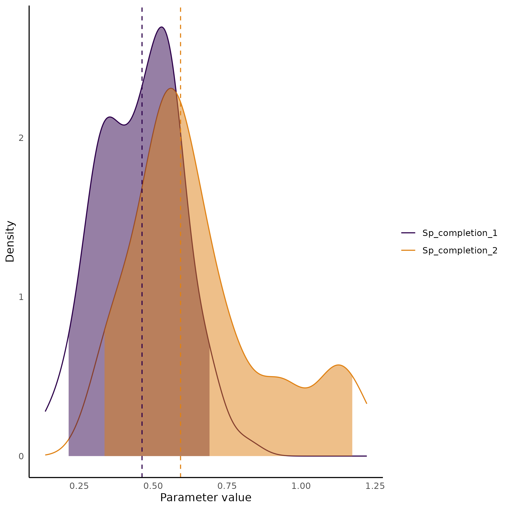

# <ins>Tra</ins>it <ins>De</ins>pendent <ins>R</ins>ates <ins>Pro</ins>tracted <ins>S</ins>peciation (Traderpros)

Traderpros is a package of python programs to estimate parameters, delimit species and simulate data under the Trait Dependent Rates Protracted Speciation model in a Bayesian framework as proposed in Azevedo et al. (in prep) . There are also programs to summarize results and plot graphs. Traderpros programs allow users to simply run the model and check results using unix command line interface.  

## The Traderpros Model
The protracted speciation model was first proposed by Rosindell et al. (2010) and have been further developed and used for understand diversification and for species delimitation. Our approach consist of modeling the population tree branching pattern as a SSE model and the number of speciation completion events on the brach as extended Poisson process similar to the one used in [DELINEATE](https://jeetsukumaran.github.io/delineate/) (Sukumaran et al. 2021). The difference is that the speciation completion rate in each branch will vary according to the state in that branch instead of a single global rate. That is, ```N_speciation_events_branch[i] ~ Poisson(state_branch_rate[i]*branch_length[i])``` where *i* is the branch in the tree, and *state_branch_rate[i]* is the rate accounting for the time spent in each trait state in the branch *i*. To sample the trait history evolution along the tree and obtain the the time spent in each states on a branch, we use a data augmentation approach in similar way that is done for continuous trait evolution by [May and Moore (2020)][^4] (see also [RevBayes tutorial on data augmentation](https://revbayes.github.io/tutorials/cont_traits/state_dependent_bm.html)). For the Birth and Death process, we decided to use a Binary State Dependent Speciation and Extinction with hidden rates (HiSSE) because it has been shown to improve parameter estimation, including the trait transition rates which are important for the trait history data augmentation. However, any kind of Birth and Death process can be use. Although the Python wrapper program we developed here only implements HiSSE, you can modify the RevBayes script to adapt it to your data needs. 
  
> [!Note]
>>It is important notice also that our current implementation does not include Hidden states for the protracted part of the model. We stress that that could be a further development and that tests regarding the power and identifiability of the model should be performed. Our preliminary exploration suggested that the use of four states with our tree were not able to inform the model and the posterior was identical to the prior, and bigger tress with may be necessary for accurate infer parameters when a hidden (or more than 2 observed states) are used.  

To estimate the speciation completion rate, we used constraints informed by the population to species map (species matrix file). We know that speciation completion did not happened on branches that connect populations, so we can clamp the number of speciation events to 0. If the branches connects populations of two different species, at least one speciation event must have happened along the path connecting these two heterospecific populations. Branches that connect populations with unknown status or that connects more than two species are not used as constraints and the posterior distribution of the number of speciation completion events on those branches are estimate. Therefore, a population tree with many populations per species must be used. Some population with unknown identity status can be used and the results of the probability of speciation on the branches connection these populations to others can be used for species delimitation (see below).  


  

More detailed explanation of the algorithm can be seen at the [RevBayes script Tutorial](./TutorialRev).

> [!Note]
>> Our package is limited to the model priors and parameters provided in [Azevedo et al. (2024)](). We strongly recommend you to check the [RevBayes Tutorial](./TutorialRev/) for better understanding of the steps and customization of models to better use it with your data. The use of *traderpros* program with the argument *--just_script* produce the RevBayes script without running the analysis it self, and it can be useful for customization.

## The programs
[traderpros](./src/traderpros.py) and [traderpros_sim](./src/traderpros_sim.py) generates Rev scripts and calls [RevBayes](https://revbayes.github.io/) to run them.  [traderpros](./src/traderpros.py) is used for estimating parameters and fos species delimitation. [traderpros_sim](./src/traderpros_sim.py) is used for simulations.
  
[sum_and_plot](./src/sum_and_plot.py) is a wrapper of [customized R functions](./src/custom_R_functions/) that uses [RevGadgets](), [coda]() and [ggplot2]() to summarize and plot posterior distribution of parameters and probability pie charts of the different models tested with Reversible Jump MCMC (e.g. if a irreversible model of trait is more likely; if there is association between traits and rates, etc...).  
  
[conspecific_probs](./src/conspecific_probs.py) and [conspecific_binary](./src/conspecific_binary.py) are functions that use [DendroPy](https://jeetsukumaran.github.io/DendroPy) library for visualization of species delimitation results.  [conspecific_probs](./src/conspecific_probs.py) generates a heatmap with the probability of two tips (populations or individuals) be conspecific.  [conspecific_binary](./src/conspecific_binary.py) shows if two tips were estimated in the maximum *a posteriori* result as being conspecific or not.
  
>[!Important]
>All dependencies must be installed and accessible from command line (they should be added to your system $PATH variable). See [Installation instructions](#installation). If you use Traderpros, please cite those dependencies.
  

## Installation  
If you do not have R and RevBayes installed and added to your $PATH, please see instructions at [R project](https://cran.r-project.org/bin/linux/ubuntu/fullREADME.html) and [RevBayes](https://revbayes.github.io/download) ([or compile from source](https://revbayes.github.io/compile-linux)) pages. This programs were tested with R version 4.4.2 and RevBayes version 1.2.5. 

Open R and Install R packages dependencies if not done yet.

> [!Note] 
>> If RevGadgets installation fails, check [instructions on the website](https://revbayes.github.io/tutorials/intro/revgadgets.html). It might be related to the "magick" R package that depends on external software [ImageMagick](https://imagemagick.org/script/download.php). 


```R
install.packages("ggplot2")
install.packages("coda")
install.packages("devtools")
devtools::install_github("YuLab-SMU/ggtree")
devtools::install_github("cmt2/RevGadgets")

# RevGadgets requires "magick" and "ggimage"
# If installation fails it might be related to those.
#install.packages("magick")
#devtools::install_github("GuangchuangYu/ggimage")
```

We suggest you to install the Traderpros in a conda environment. If you do not have conda installed in your computer, check [miniconda](https://docs.anaconda.com/miniconda/install/#quick-command-line-install) for conda installation instructions. You can use the code below to create a environment with all the python dependencies we need.

>Note: that we are using the package versions which we tested traderpros. You can try newer versions, but if it does not work, try with the specified versions)

```bash
conda create -n traderenv python=3.13.0 
conda activate traderenv
pip install seaborn==0.13.2 numpy==2.1.3 matplotlib==3.9.2 dendropy==5.0.1
```

Clone this github project and install Traderpros.

```bash
git clone https://github.com/ghfazevedo/traderpros
cd traderpros
pip install .
```

The  installation should check for the dependencies and make sure you can access R and RevBayes from the command line. You can test the program with the commands below. It should run a quick analysis.

## What you need to run your data
For running Traderpros you will need:  
1. A dated tree (in nexus or newick format) with many populations of each species as tips, [like this one for example](./CicurinaData/BPPConstraint.MCC.CAH.nex)
2. A trait matrix in nexus format associating each tip with the state found in that population, [like this one](./CicurinaData/CicTroglomorphism.nex). Note that for now, missing data are not accepted and may cause issues.
3. A tab delimited file mapping each population to a species code, which are represented by natural numbers starting from 0. Every population belonging to the same species should have the same species code. See [this file for example](./CicurinaData/CicSpeciesMatrix.txt)
4. You also should have a approximated idea of how many population probably exists in the clade (argument *-npop*). We acknowledge that this may be difficult, but we encourage to try different assumptions and see how it affects your conclusions. This should have an stronger effect on the estimative of Birth and Death parameters. If you think you have no good estimate and you think this can influence too much your results, you can try to modify the RevScript to run the analyses without the Birth and Death part of the model. 
5. You should have and expected the maximum number of sampled species in your clade (argument *-mxsp*), if you have populations with unknown species assignments. If all populations are known to belong to a species, this is the number of sampled species.

## Usage

### Estimating parameters
To estimate the parameters of the model (and delimit species if it is the case), you first use the program [traderpros](src/traderpros.py). You can run a test with the code below.

> [!Note]
>> We are running only 100 MCMC generations for speed. You can try increasing to see how long it takes with these dataset. You **DEFINITELY** must increase -ngen when using with your real data!  

```bash
conda activate traderenv

traderpros  -opre exmp_out \
            -odir exmp_out \
            -t example_data/example.tre \
            -trpt example_data/example_trait.nexus \
            -spmt example_data/example.SpeciesMatrix.txt \
            -tsph no \
            -npop 457 \
            -nhdd 2 \
            -mxsp 24 \
            -ngen 100 \
            -prsc 1 \
            -prlg 1 \
            -prtr 1 \
            -chkp 10
```

> [!Note]
>>Sometimes the analyses will freeze in the initial steps of the MCMC chain. It usually happens when you have another terminal with RevBayes opened or if you opened RevBayes in that terminal before. If that happens, close the terminals and try again. 

### Outputs
The output will be saved in the folder [exmp_out](exmp_out). The file [exmp_out.model.log](exmp_out/exmp_out.model.log) contains the samples for all parameters in the model. It should be used to check MCMC mixing (you can load it to [Tracer](https://www.beast2.org/tracer-2/) for example). However, that file contains many parameters, so, to simplify, there are also the [exmp_out.Rates.log](exmp_out/exmp_out.Rates.log), which contains the MCMC samples for rate parameters only, and the [exmp_out.RJ.log](exmp_out/exmp_out.RJ.log) which contains the probabilities of different models tested with the rjMCMC (both can be loaded into [Tracer](https://www.beast2.org/tracer-2/) too).  
The files [exmp_out.Protracted.trees](exmp_out/exmp_out.Protracted.trees) and [exmp_out.SpEvents.MAP.tre](exmp_out/exmp_out.SpEvents.MAP.tre) contains the MCMC sampled trees and the maximum *a posteriori* (MAP) tree, respectively, with speciation completion rates and speciation probabilities as branch annotations.  
The files with suffix SpEventsBrLens and SpEvents contains trees with the number of speciation events as branch lengths and as branch annotations, respectively. The MAP in the file name stands for maximum *a posteriori* as above.

The tree files [exmp_out.traits.MAP.cond.tree](exmp_out/exmp_out.traits.MAP.cond.tree) and [exmp_out/exmp_out.traits.MAP.marg.tree](exmp_out/exmp_out.traits.MAP.marg.tree) have the trees with the conditional and marginal MAP reconstruction of the ancestral states.
  
### Summarize and visualize results
The program [sum_and_plot.py](src/sum_and_plot.py) uses the output generated to summarize and plot results.

```
sum_and_plot \
     --out_dir exmp_out_FIGS \
     --in_dir  exmp_out \
     --prefix_used_in_traderpros  exmp_out \
     --burn  0.1 \
     --out_images_format  "both" \
     --path_to_custom_functions  src/custom_R_functions
```
>[!Note]
>> Some ggplot2 warning messages may appear ("Please consider using `annotate()`..."). It is fine, you don't need to worry.  

It will generate pdf and png figures of trees with branch rates (extinction, birth and speciation completion), of the posterior distribution of each state specific rates and transition rates, and pie charts of the probability of models (e.g. if speciation completion rate is state dependent).

Below you can see the tree with estimated speciation completion rates on branches.


Here is the posterior distribution of the rates associated with each state. The dashed lines represents the median value of the distribution:


The probability of the speciation completion be dependent on the state is:


The tree with ancestral state reconstructed:


Lastly, the file [exmp_out.RatesSummStats.csv](exmp_out_FIGS/exmp_out.RatesSummStats.csv) contains summary statistics for the rate variables.


### Species delimitation results
If you are interested in species delimitation, you should chack the output with extension [.SpEvents.tree.](exmp_out_FIGS/traderpros.SpEvents.tree.png). It contains the estimated number of speciation events on each branch. All terminals that are connected by branches with no speciation events belongs to same species. you should look for the terminals which were coded with "?" in the species matrix file.


To facilitate you can use [conspecific_binary.py](src/conspecific_binary.py) to see pairwise comparison. You can use `-tax` or `--keep_only_taxa` to plot only focal taxa instead of the complete tree. The program takes as input the MAP tree with information on the number of speciation events 

```
conspecific_binary \
     -ant exmp_out/exmp_out.SpEvents.MAP.tre \
     -tax pop93,pop78,pop86,pop94,pop179,pop180,pop143,pop57,pop58,pop52 \
     -od exmp_out_FIGS \
     -pre exmp_out
```
The file with suffix [_heatmap.binsp.png](exmp_out_FIGS/exmp_out_heatmap.binsp.png). will have the results. Blue squares mean same species.


### Command reference
Type name of the program with the flag *-h*  to see all options and defaults.

#### traderpros
```
usage: traderpros [-h] [-s SEED_NUMBER] [-opre OUT_PREFIX] [-odir OUT_DIR] -t TREE_PATH -trpt TRAIT_PATH -spmt SP_MATRIX [-tsph {yes,no}] [-ptph TENSOR_PATH]
                  -npop NUM_TOTAL_POPULATIONS [-nhdd NUM_HIDDEN] [-mhdd MEAN_HIDDEN_HYPERPRIOR] [-nproc NUM_PROCESSORS] [-trpr TRANSITION_PRIOR_PARAM]
                  [-btpr BIRTH_PRIOR_PARAM] [-dtpr DEATH_PRIOR_PARAM] [-sppr SPECIATION_PRIOR_PARAM] -mxsp MAX_NUM_SPECIES [-mvit CHAR_MOVE_INTENSITY]
                  [-ngen N_GEN] [-prsc PRINT_SCREEN] [-prlg PRINT_LOG] [-prtr PRINT_TREE] [-nrun N_RUNS] [-chkp CHECK_POINT_INTERVAL] [-burn BURN_IN]
                  [-justscript JUST_SCRIPT]

Estimate parameters of a trait dependent protracted speciation model.

options:
  -h, --help            show this help message and exit
  -s, --seed_number SEED_NUMBER
                        Seed number for replication (default: 0).
  -opre, --out_prefix OUT_PREFIX
                        Output file prefix (default: "Traderpros").
  -odir, --out_dir OUT_DIR
                        Output directory (default: "trader_out").
  -t, --tree_path TREE_PATH
                        Tree file path (mandatory).
  -trpt, --trait_path TRAIT_PATH
                        Trait data file path (mandatory).
  -spmt, --sp_matrix SP_MATRIX
                        Species matrix file path (mandatory).
  -tsph, --use_tensor {yes,no}
                        Specify "yes" to use TensorPhylo or "no" to not use it (default: "no"). TensorPhylo is a library to speed up likelihood computation for
                        SSE models. It need to be downloaded and installed separatly. See details on TensorPhylo at https://bitbucket.org/mrmay/tensorphylo/.
                        Note: As for 20 Nov 2024 - Sometimes it throws an error and interrupts analysis.
  -ptph, --tensor_path TENSOR_PATH
                        TensorPhylo plugin path (required if use_tensor=True).
  -npop, --num_total_populations NUM_TOTAL_POPULATIONS
                        Total number of populations (mandatory).
  -nhdd, --num_hidden NUM_HIDDEN
                        Number of hidden states (default: 2).
  -mhdd, --mean_hidden_hyperprior MEAN_HIDDEN_HYPERPRIOR
                        Mean hidden hyperprior (default: 0.587405).
  -nproc, --num_processors NUM_PROCESSORS
                        Number of processors (default: 4). only used if using TensorPhylo plugin.
  -trpr, --transition_prior_param TRANSITION_PRIOR_PARAM
                        Transition prior parameter (default: 10).
  -btpr, --birth_prior_param BIRTH_PRIOR_PARAM
                        Birth prior parameter (default: 1).
  -dtpr, --death_prior_param DEATH_PRIOR_PARAM
                        Death prior parameter (default: 1).
  -sppr, --speciation_prior_param SPECIATION_PRIOR_PARAM
                        Speciation prior parameter (default: 1).
  -mxsp, --max_num_species MAX_NUM_SPECIES
                        Max number of species (mandatory).
  -mvit, --char_move_intensity CHAR_MOVE_INTENSITY
                        Character move intensity (default: 0.5).
  -ngen, --n_gen N_GEN  Number of generations (default: 10000).
  -prsc, --print_screen PRINT_SCREEN
                        Print screen interval (default: 100).
  -prlg, --print_log PRINT_LOG
                        Print log interval (default: 100).
  -prtr, --print_tree PRINT_TREE
                        Print tree interval (default: 100).
  -nrun, --n_runs N_RUNS
                        Number of parallel runs (default: 1).
  -chkp, --check_point_interval CHECK_POINT_INTERVAL
                        Check point interval (default: 1000).
  -burn, --burn_in BURN_IN
                        Burn-in percentage (default: 0.10).
  -justscript, --just_script JUST_SCRIPT
                        Create script only, do not run (default: False).
```
#### sum_and_plot
```
usage: sum_and_plot [-h] [-od OUT_DIR] -in IN_DIR -pre PREFIX_USED_IN_TRADERPROS [-b BURN] [--color_completion COLOR_COMPLETION]
                    [--color_n_speciation COLOR_N_SPECIATION] [--color_birth COLOR_BIRTH] [--color_death COLOR_DEATH] [--color_net COLOR_NET]
                    [--color_transition COLOR_TRANSITION] [--anc_state_labels ANC_STATE_LABELS] [--anc_state_colors ANC_STATE_COLORS]
                    [--path_to_custom_functions PATH_TO_CUSTOM_FUNCTIONS] [--out_images_format {pdf,png,both}]

Python wrapper for sum_and_plot_traderpros_result in R.

options:
  -h, --help            show this help message and exit
  -od, --out_dir OUT_DIR
                        Output directory
  -in, --in_dir IN_DIR  Input directory
  -pre, --prefix_used_in_traderpros PREFIX_USED_IN_TRADERPROS
                        Prefix used in TraderPros output
  -b, --burn BURN       Burn-in percentage
  --color_completion COLOR_COMPLETION
                        Comma-separated colors for completion rate
  --color_n_speciation COLOR_N_SPECIATION
                        Comma-separated colors for number of speciation events
  --color_birth COLOR_BIRTH
                        Comma-separated colors for birth rates
  --color_death COLOR_DEATH
                        Comma-separated colors for death rates
  --color_net COLOR_NET
                        Comma-separated colors for net diversification
  --color_transition COLOR_TRANSITION
                        Comma-separated colors for transitions
  --anc_state_labels ANC_STATE_LABELS
                        Comma-separated ancestral state labels
  --anc_state_colors ANC_STATE_COLORS
                        Comma-separated colors for ancestral states
  --path_to_custom_functions PATH_TO_CUSTOM_FUNCTIONS
                        Path to custom functions
  --out_images_format {pdf,png,both}
                        Output image format
```
#### conspecific_binary
```
usage: conspecific_binary [-h] [-ant ANNOTATED_TREE] [-brt BRANCH_LENGTH_TREE] [-od OUT_DIR] [-pre PREFIX] [-tax KEEP_ONLY_TAXA] [-fgs FIGSIZE] [-fts FONTSIZE]

Create plot of conspecificity.

options:
  -h, --help            show this help message and exit
  -ant, --annotated_tree ANNOTATED_TREE
                        Path to tree with speciation events as branch/node annotations (in Nexus format). The annotation should be name
                        branch_speciation_events.
  -brt, --branch_length_tree BRANCH_LENGTH_TREE
                        Path to tree with speciation events as branch lengths (Nexus format)
  -od, --out_dir OUT_DIR
                        Output directory
  -pre, --prefix PREFIX
                        Prefix for output files
  -tax, --keep_only_taxa KEEP_ONLY_TAXA
                        Comma-separated list of focal taxa to plot. At least two should be provided
  -fgs, --figsize FIGSIZE
                        Figure size as width,height (default: '12,10')
  -fts, --fontsize FONTSIZE
                        Font size for labels and ticks (default: 10)
```
#### conspecific_probs
```
usage: conspecific_probs [-h] -pt PROTRACTED_TREE [-od OUT_DIR] [-pre PREFIX] [-tax KEEP_ONLY_TAXA] [-fgs FIGSIZE] [-fts FONTSIZE]

Calculate conspecific probabilities and create heatmap

options:
  -h, --help            show this help message and exit
  -pt, --protracted_tree PROTRACTED_TREE
                        Path to protracted tree (Nexus format)
  -od, --out_dir OUT_DIR
                        Output directory
  -pre, --prefix PREFIX
                        Prefix for output files
  -tax, --keep_only_taxa KEEP_ONLY_TAXA
                        Comma-separated list of focal taxa to plot. At least two should be provided
  -fgs, --figsize FIGSIZE
                        Figure size as width,height (default: '12,10')
  -fts, --fontsize FONTSIZE
                        Font size for labels and ticks (default: 10)
```

#### traderpros_sim
```
usage: traderpros_sim [-h] [-phy PHYLOGENY] [-s SEED_NUMBER] [-opre OUT_PREFIX] [-odir OUT_DIR] -tr TRANSITION_RATES -rp ROOT_PROBS -sc SP_COMPLETION_RATES
                      [-ns N_SIMULATIONS] [-justscript] [-org] [-unk N_UNKNOWN_SP]

Simulates data under the Traderpros model.

options:
  -h, --help            show this help message and exit
  -phy, --phylogeny PHYLOGENY
                        Phylogenetic tree in nexus or newick.
  -s, --seed_number SEED_NUMBER
                        Seed number for replication (default: 0).
  -opre, --out_prefix OUT_PREFIX
                        Output file prefix (default: "Traderpros").
  -odir, --out_dir OUT_DIR
                        Output directory (default: "trader_out").
  -tr, --transition_rates TRANSITION_RATES
                        A comma-separated list of transition rates between observed states. It should be absolute rates. First value represents transition from
                        0 to 1 and second value should be the 1 to 0 transition (mandatory).
  -rp, --root_probs ROOT_PROBS
                        A comma-separated list of probabilities for the all 4 root states (Observed 0 Hidden A, Observed 1 Hidden A, Observed 0 Hidden B,
                        Observed 1 Hidden B). It could be values that sum to 1, or relative weights for a simplex. E.g. -rp 1,0,1,0 will translate to 0.5, 0.0,
                        0.5, 0.0 (mandatory).
  -sc, --sp_completion_rates SP_COMPLETION_RATES
                        A comma-separated list of state specific speciation completion rates for observed states (mandatory).
  -ns, --n_simulations N_SIMULATIONS
                        The number of simulations (default: 1).
  -justscript, --just_script
                        Create script only, do not run (default: False).
  -org, --organize_folder
                        Organize files into folders by simulation. (default: False)
  -unk, --n_unknown_sp N_UNKNOWN_SP
                        Number of tips to be set as "unknown" species assignment in the Species Matrix file for testing application of the model for species
                        delimitation (default: 0)
```

## Reproducing analyses from Azevedo et al.
To reproduce the analyses present in [Azevedo et al. (in prep)](), run the following codes.

```bash
traderpros  -opre CicRun01 \
            -odir CicRun01 \
            -t CicurinaData/BPPConstraint.MCC.CAH.nex \
            -trpt CicurinaData/CicTroglomorphism.nex \
            -spmt CicurinaData/CicSpeciesMatrix.txt \
            -tsph no \
            -npop 457 \
            -nhdd 2 \
            -mxsp 24 \
            -ngen 100000 \
            -prsc 10 \
            -prlg 100 \
            -prtr 100 \
            -chkp 1000 \
            --char_move_intensity 0.75 \
            -seed_number 1399061603


traderpros  -opre CicRun02 \
            -odir CicRun02 \
            -t CicurinaData/BPPConstraint.MCC.CAH.nex \
            -trpt CicurinaData/CicTroglomorphism.nex \
            -spmt CicurinaData/CicSpeciesMatrix.txt \
            -tsph no \
            -npop 457 \
            -nhdd 2 \
            -mxsp 24 \
            -ngen 100000 \
            -prsc 10 \
            -prlg 100 \
            -prtr 100 \
            -chkp 1000 \
            --char_move_intensity 0.75 \
            -seed_number 1605601039

sum_and_plot \
     --out_dir CicRun01FIGS \
     --in_dir  CicRun01 \
     --prefix_used_in_traderpros  CicRun01 \
     --burn  0.1 \
     --out_images_format  "both" \
     --path_to_custom_functions  src/custom_R_functions

conspecific_binary \
     -ant CicRun01/CicRun01.SpEvents.MAP.tre \
     -od CicRun01SPLIMITS \
     -pre CicRun01 \
     -tax bullis_StoneO_StrLit,bullis_StoneO_UpCree,bullis_StoneO_GenCav,bullis_StoneO_Hilger,bullis_StoneO_BunHol,bullis_StoneO_RooCan,bullis_StoneO_281162,bullis_StoneO_ClasFea,bullis_StoneO_EagNes,bullis_StoneO_281167,bullis_StoneO_QuiCap,bullis_StoneO_HEB,neovespera_UTSA_CE2160,baroniaCF_StoneO_GreeMt,baroniaCF_StoneO_TusHei,baronia_AlamoH_OblPit,baronia_AlamoH_Robber

conspecific_probs \
     -pt CicRun01/CicRun01.Protracted.MAP.tre \
     -od CicRun01SPLIMITS \
     -pre CicRun01 \
     -tax bullis_StoneO_StrLit,bullis_StoneO_UpCree,bullis_StoneO_GenCav,bullis_StoneO_Hilger,bullis_StoneO_BunHol,bullis_StoneO_RooCan,bullis_StoneO_281162,bullis_StoneO_ClasFea,bullis_StoneO_EagNes,bullis_StoneO_281167,bullis_StoneO_QuiCap,bullis_StoneO_HEB,neovespera_UTSA_CE2160,baroniaCF_StoneO_GreeMt,baroniaCF_StoneO_TusHei,baronia_AlamoH_OblPit,baronia_AlamoH_Robber
```

##### Simulating data as in Azevedo et al.
Use the commands below to simulate two sets of data, one with different speciation completion rates (state dependent) and another with equal rates.

```
traderpros_sim \
  -opre sim  \
  -odir simRates_0.305_0.275 \
  -phy CicurinaData/BPPConstraint.MCC.CAH.nex \
  -tr 0.099134,0.099134 \
  -rp 0.5,0.5 \
  -sc 0.305,0.275 \
  -ns 50 \
  -org \
  -unk 3

traderpros_sim \
  -opre sim  \
  -odir simRates_0.29_0.29 \
  -phy CicurinaData/BPPConstraint.MCC.CAH.nex \
  -tr 0.099134,0.099134 \
  -rp 0.5,0.5 \
  -sc 0.29,0.29 \
  -ns 50 \
  -org \
  -unk 3

traderpros_sim \
  -opre sim  \
  -odir simRates_0_435_0_145 \
  -phy CicurinaData/BPPConstraint.MCC.CAH.nex \
  -tr 0.099134,0.099134 \
  -rp 0.5,0.5 \
  -sc 0.435,0.145 \
  -ns 50 \
  -org \
  -unk 3

```
The code below was used to run each simulated data from each simulated data folder.

```
cd projects/traderpros/traderpros/simRates_0_305_0_275/Sim*
number_species=$(head -n 1 sim.*.spp.Sim*.txt)


traderpros  -opre Sim \
            -odir SimOut \
            -t sim_Tree.Sim*.tre \
            -trpt sim_trait.Sim*.nexus \
            -spmt sim.SpeciesMatrixUnkn.Sim*.txt \
            -tsph no \
            -npop 457 \
            -nhdd 2 \
            -mxsp $number_species \
            -ngen 100000 \
            -prsc 10 \
            -prlg 100 \
            -prtr 100 \
            -chkp 1000 \
            --char_move_intensity 0.75


# Loop over folders to summarize results
cd projects/traderpros/traderpros/simRates_0_305_0_275
folders=$(ls -1)
for i in $folders
  do
    sum_and_plot \
         --out_dir $i/SimOutSum \
         --in_dir  $i/SimOut \
         --prefix_used_in_traderpros  Sim \
         --burn  0.1 \
         --out_images_format  "both" \
         --path_to_custom_functions  /home/ghfa/projects/traderpros/traderpros/src/custom_R_functions
done

for i in $folders
  do
    conspecific_binary \
         -ant $i/SimOut/Sim.SpEvents.MAP.tre \
         -od  $i/SimOutSpLim \
         -pre Sim
done

# Plot the true species limits matrix
folders=$(ls -1)
for i in $folders
  do
    conspecific_binary \
         -brt $i/sim_TrBrLen.$i.tre \
         -od  $i/SimTrueSpLim \
         -pre SimTrueSpLim
done


# Other set of simulations
cd projects/traderpros/traderpros/simRates_0_29_0_29
conda activate traderenv

traderpros  -opre Sim \
            -odir SimOut \
            -t sim_Tree.Sim*.tre \
            -trpt sim_trait.Sim*.nexus \
            -spmt sim.SpeciesMatrixUnkn.Sim*.txt \
            -tsph no \
            -npop 457 \
            -nhdd 2 \
            -mxsp 33 \
            -ngen 100000 \
            -prsc 10 \
            -prlg 100 \
            -prtr 100 \
            -chkp 1000 \
            --char_move_intensity 0.75

folders=$(ls -1)
for i in $folders
  do
    sum_and_plot \
         --out_dir $i/SimOutSum \
         --in_dir  $i/SimOut \
         --prefix_used_in_traderpros  Sim \
         --burn  0.1 \
         --out_images_format  "both" \
         --path_to_custom_functions  /home/ghfa/projects/traderpros/traderpros/src/custom_R_functions
done

for i in $folders
  do
    conspecific_binary \
         -ant $i/SimOut/Sim.SpEvents.MAP.tre \
         -od  $i/SimOutSpLim \
         -pre Sim
done


# Plot the true species limits matrix
folders=$(ls -1)
for i in $folders
  do
    conspecific_binary \
         -brt $i/sim_TrBrLen.$i.tre \
         -od  $i/SimTrueSpLim \
         -pre SimTrueSpLim
done

``` 

## References
Azevedo G.H.F., Blair J., Hedin M. (in prep). Trait dependent protracted speciation model illuminates the influence of troglomorphism on the diversification of cave meshweaver spiders threatened by urbanization.

Rosindell J., Cornell S.J., Hubbell S.P., Etienne R.S. (2010). Protracted speciation revitalizes the neutral theory of biodiversity. [Ecology Letters. 13:716–727](https://doi.org/10.1111/j.1461-0248.2010.01463.x).

Sukumaran J., Holder M.T., Knowles L.L. (2021) Incorporating the speciation process into species delimitation. [PLOS Computational Biology 17(5): e1008924](ttps://journals.plos.org/ploscompbiol/article?id=10.1371/journal.pcbi.1008924) 
